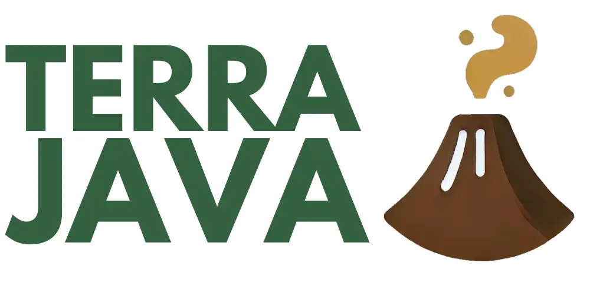
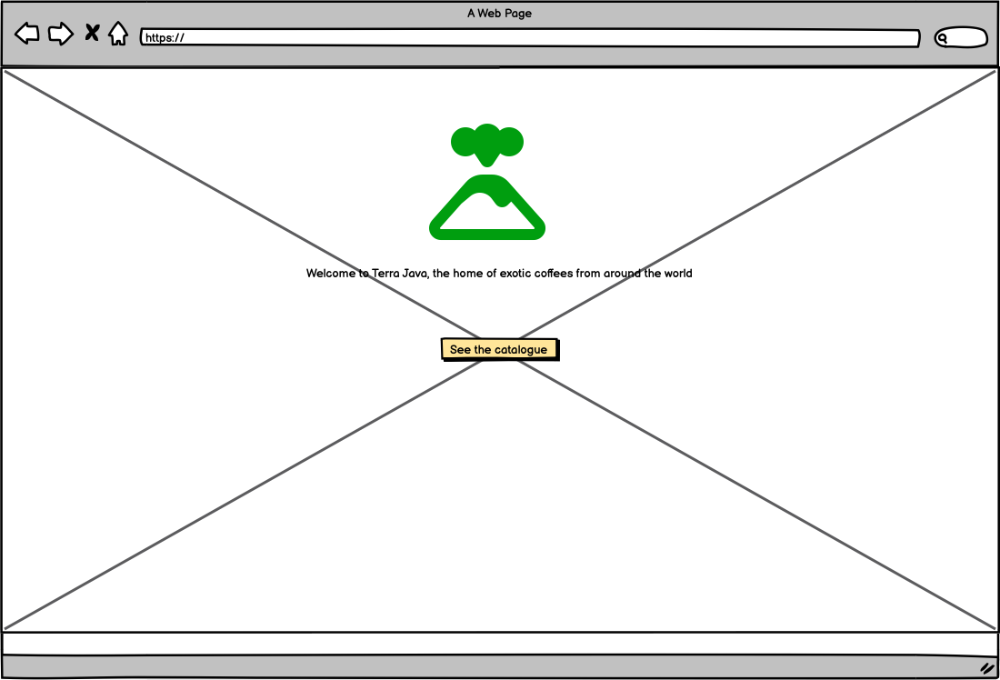
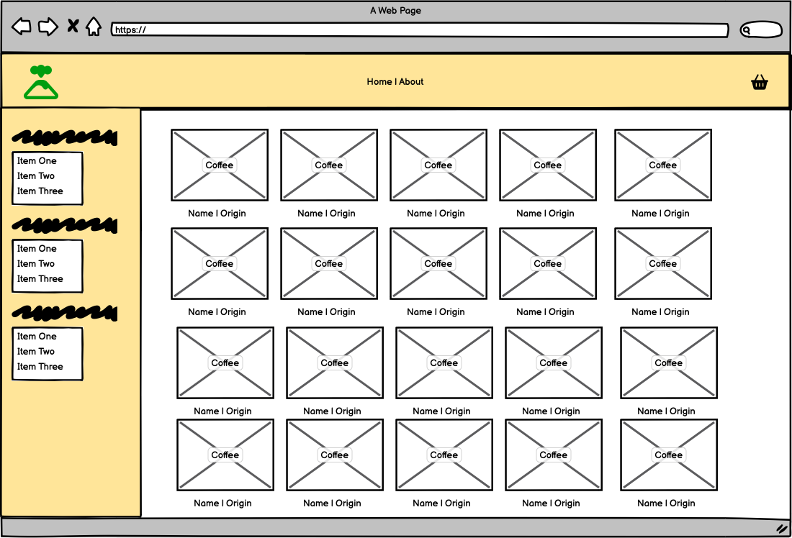
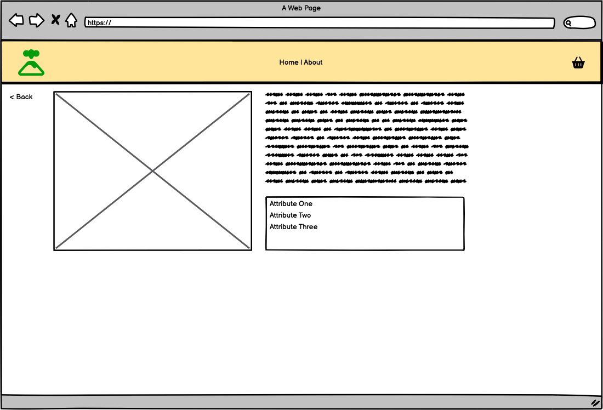

# Terra Java

## Overview
Terra Java is a boutique catalogue of all the world's finest coffee blends. Taking its name from the rich coffee fields found on the island of Java in western Indonesia, it aims to showcase the very best coffees from around the globe.

Vendors are able to register themselves on the site and upload, edit and delete their coffees.
Visitors can filter the coffees by attibutes - region, bitterness, bean (Arabica, Robusta, Liberica, and Excelsa)

## UX Design Process

### Graphic design and visual assets:
[Selected colour pallate](https://coolors.co/4f3221-34623f-ffee7d-c1b098-ffffff)

Logo: 
</img>

Image credits: 
[Ashlyn Ciara](https://unsplash.com/@ashlynciara?utm_content=creditCopyText&utm_medium=referral&utm_source=unsplash) on [Unsplash](https://unsplash.com/photos/a-man-in-a-hat-picking-berries-from-a-bush-4rbWwrtMQ1c?utm_content=creditCopyText&utm_medium=referral&utm_source=unsplash)

[wojtal78](https://www.istockphoto.com/portfolio/wojtal78?mediatype=photography) on [iStockPhoto](https://www.istockphoto.com/photo/coffee-bag-gm509212479-45793256?searchscope=image%2Cfilm)

[PROJETO CAFÉ GATO-MOURISCO](https://unsplash.com/@projetocafegatomourisco?utm_content=creditCopyText&utm_medium=referral&utm_source=unsplash) on [Unsplash](https://unsplash.com/photos/a-lush-green-hillside-covered-in-lots-of-trees-zOVRgigQMQA?utm_content=creditCopyText&utm_medium=referral&utm_source=unsplash)

[Nitin Khajotia on Pexels](https://www.pexels.com/video/a-view-of-a-lush-green-valley-with-mountains-in-the-background-19669269/)

### User flow and ERD
  - [Link to Miro](https://miro.com/app/board/uXjVLuC7tmQ=/?share_link_id=877125417995)

### User stories and Project board
  - [Terra Java project board](https://github.com/users/alexaspinalldev/projects/10)

### Wireframes:
</img>
</img>
</img>
    
        - **Design Rationale:**
          - [Explain key design decisions, such as layout, colour scheme, typography, and how accessibility guidelines (e.g., WCAG) were integrated.]
          - [Highlight any considerations made for users with disabilities, such as screen reader support.]
        
        - **Reasoning For Any Final Changes:**
          - [Summarise significant changes made to the design during development and the reasons behind them.]
          - [Reflect on how these changes enhance inclusivity and accessibility.]

        ## Key Features
        - **Feature 1:** [Briefly describe the implemented feature.]
        - **Feature 2:** [Briefly describe the implemented feature.]
        - **Inclusivity Notes:** 
          - [Mention how the features address the needs of diverse users, including those with SEND.]

## Deployment
- **Platform:** Heroku
- **High-Level Deployment Steps:** 
  1. Ensure project is set correctly for deployment
  2. Push code to Github
  3. Deploy from main in Heroku dashboard
- **Verification and Validation:**
  - All CRUD operations were retested manually in the deployed version. Often this was faster for making DB changes than spooling up the local server.

- **Security Measures:**
  - Use of environment variables for sensitive data.
  - Ensured DEBUG mode is disabled in production.

## AI Implementation and Orchestration

### Use Cases and Reflections:
  - **Site Ideation:**
    - The name of the site was picked from a list of keyword provided by ChatGPT. DALLE was used to create the logo.
    - AI was also used to expand the user stories from the initial prompt describing the site's functions.
       
  - **Content:** 
    - Once the ERD was complete, GPT was used to create a JSON import scripts for the lists of Vendors and Coffees. Later I also had it create Python shell scripts to add field data such as vendor.about to the existng database.

  - **Code Creation:** 
    - GPT was used to cross-examine my proposed ERD, suggesting new fields, and then create the model objects. I also used it to suggest improvements to my client javascript, such as in the "loading modal" where I had it add a condition for users ctrl+clicking on the triggering links.

  - **Debugging:** 
    - GPT was utilised lightly to fix initial issues with my views, and also to troubleshoot issues with my DTL variables and static files not being found.

  - **Performance and UX Optimization:** 
    - AI was not used for this purpose

  - **Automated Unit Testing:**
    - Reflection: Adjustments were made to improve test coverage and ensure alignment with functionality. Prompts were used to generate inclusive test cases that considered edge cases for accessibility.

- **Overall Impact:**
  - AI tools streamlined repetitive tasks, enabling focus on high-level development.
  - Efficiency gains included faster debugging, comprehensive testing, and improved code quality.
  - Challenges included contextual adjustments to AI-generated outputs, which were resolved effectively, enhancing inclusivity.

## Testing Summary
- **Manual Testing:**
  - **Devices and Browsers Tested:** Tested manually on desktop and mobile devices
  - **Features Tested:** Signing up, logging in and out, adding, editing and removing Coffee listing fucntions were tested manually on all devices.
  - **Results:** Mobile testing revealed a few bugs including stretched images and some specific restrictions on iOS around video autoplaying. This later issue was resolved by checking the Apple documentation on the subject.
- **Automated Testing:**
  - Tools Used: Django Test
  - Features Covered: CoffeeAdd, CoffeeUpdate and SignUp forms were tested using automated test cases. I had issues doing this using class-based test so I instead opted to test through the Python Shell. AI suggested this alternative approach. I could not get Automated view testing working unfortunately so had to rely on manual testing results.
  - Adjustments Made: On my Coffee model, I had neglected to include the mandatory "max_length" attribute on my choice field. Resolving this allowed my form tests to pass.
- **Validation:**
  - **HTML:**
  - **CSS:**
  - **JS:**

## Future Enhancements
- Add more explicit view to Vendors of their listings that are unapproved, rather than filtering those out for all users
- Add greater sidebar filtering options
- Add a more appropriate homepage than just launchng straight into the catalogue
- Add a webstore app to the site
- Add the ability to contact vendors
- Add the ability to leave reviews for the coffees